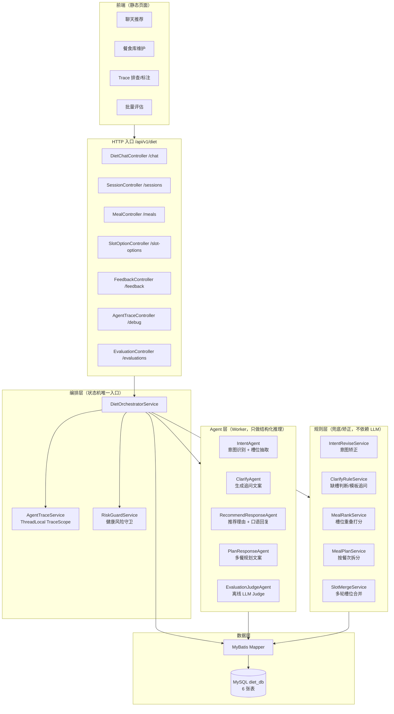
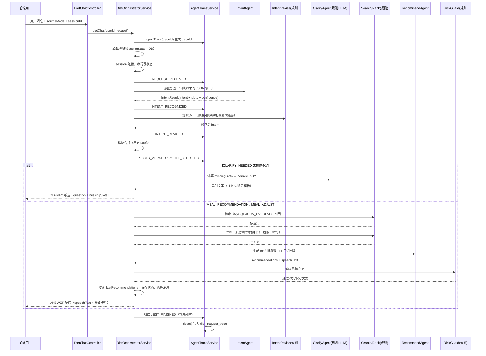
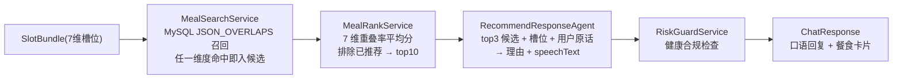
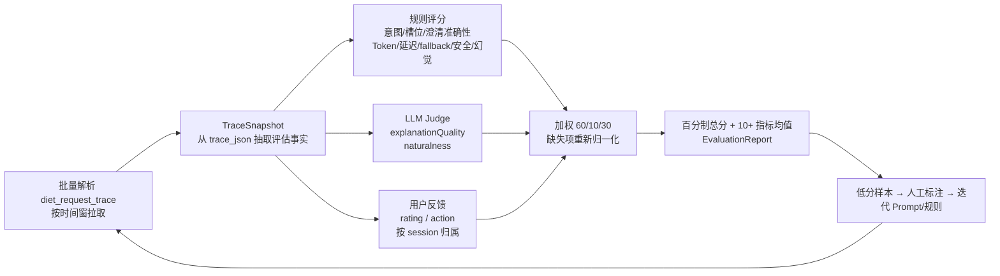
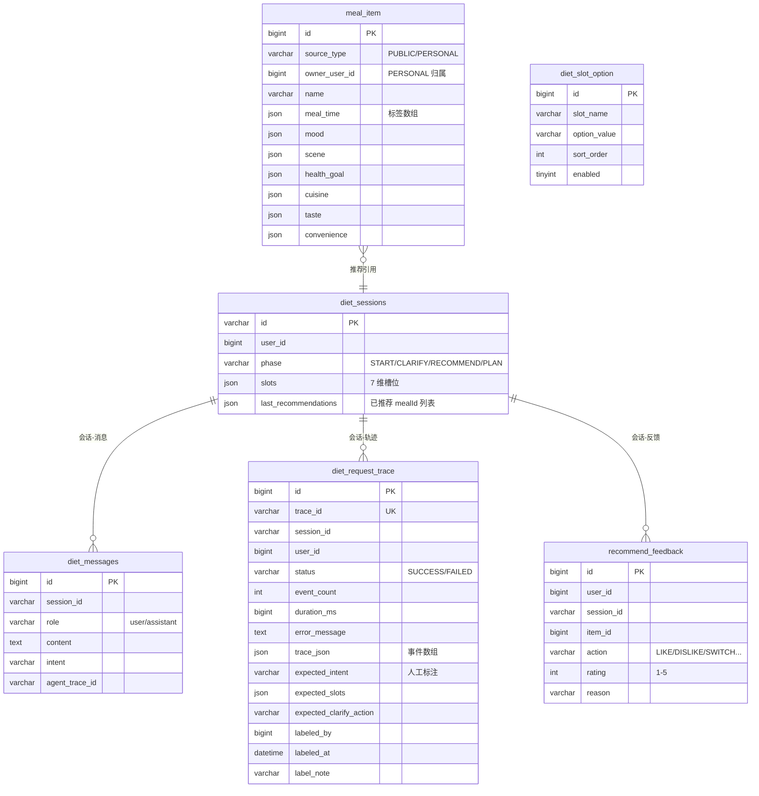

# diet-agent 系统设计

> 面向“不知道吃什么”的日常就餐决策场景，用多 Agent 协作 + 全链路 Trace 可观测 + 离线评估闭环，构建对话式智能饮食推荐系统。

---

## 1. 项目定位

一句话：**一个“聊着天帮你决定今天吃什么”的多 Agent 对话系统**。

核心命题是解决 LLM 黑盒带来的三个工程问题：

1. **不可控** —— LLM 输出不确定，可能错误路由、幻觉推荐、说风险话术；
2. **不可观测** —— 线上出问题无法回放、无法定位是哪一步 LLM 或哪条规则导致的；
3. **不可评估** —— 效果好坏没有量化指标，无法驱动迭代。

对应到项目里的三大设计支柱：

| 设计支柱 | 落地模块 | 解决什么问题 |
|---|---|---|
| 编排中枢 + 专职 Worker | `DietOrchestratorService` + 4 个 Agent | LLM 只做结构化推理，状态流转与路由由 Java 编排层管控 |
| Trace 全链路可观测 | `AgentTraceService` + `diet_request_trace` | 每一轮对话的每个关键节点输入/输出/耗时/Token 全部落库，可回放排查 |
| 离线评估闭环 | `EvaluationService` + LLM Judge + 用户反馈 | 规则 60% + Judge 10% + 用户反馈 30% 加权打分，低分样本回流迭代 |

---

## 2. 技术栈

| 层 | 选型 |
|---|---|
| 语言 / 框架 | Java 21 + Spring Boot 3.3.13 |
| ORM | MyBatis 3.0.4（XML Mapper） |
| 数据库 | MySQL 8（`JSON_OVERLAPS` 做 JSON 标签召回） |
| LLM 框架 | AgentScope（`io.agentscope:agentscope-spring-boot-starter 1.0.11`），底层接阿里云 DashScope |
| 模型 | 主模型 `qwen-max`（推荐理由生成）、轻量模型 `qwen-turbo`（意图/澄清/Judge） |
| 前端 | 原生 HTML/JS 单页应用（hash 路由），由 Spring Boot 静态资源直接托管 |
| 其他 | Lombok、Hutool、Jackson |

---

## 3. 整体架构



---

## 4. 核心对话链路（一次 `POST /chat` 的全过程）



---

## 5. 多 Agent 协作设计

### 5.1 分层原则

- **编排层（Orchestrator）** 是唯一写 `SessionState` 的角色：负责加载会话、锁、路由、调用顺序、落库。
- **Worker Agent 层** 只做“输入 → 结构化输出”的推理，不持有业务状态：
  - `IntentAgent`：输出 `{intent, slots, confidence}`
  - `ClarifyAgent`：输出一句话追问
  - `RecommendResponseAgent`：输出 `{recommendations[], speechText}`
  - `PlanResponseAgent`：输出 `{mealPlans[], speechText}`
- **Agent 实例按 session 缓存**：`AgentFactory` 用 LRU（上限 1000）缓存每个会话的一组 Agent，key 含 `promptVersion`，避免跨用户记忆串线、prompt 升级后复用旧实例。

### 5.2 模型分工

| Agent | 模型 | 职责 |
|---|---|---|
| IntentAgent | qwen-turbo（轻量） | 意图分类 + 槽位抽取，字典强约束 |
| ClarifyAgent | qwen-turbo（轻量） | 缺槽时生成自然追问 |
| RecommendResponseAgent | qwen-max（主） | 结合候选与槽位写推荐理由和口语回复 |
| PlanResponseAgent | qwen-max（主） | 多餐方案文案 |
| EvaluationJudgeAgent | qwen-turbo（轻量） | 离线打分 explanationQuality/naturalness |

---

## 6. 意图识别与兜底（三层防御）

### 6.1 意图体系

6 类意图（`Intent` 枚举）：
`MEAL_RECOMMENDATION`（求推荐）、`CLARIFY_NEEDED`（信息不足）、`MEAL_ADJUST`（换一批/调整）、`MEAL_PLAN`（多餐规划）、`HEALTH_RISK`（健康风险）、`OTHER`（闲聊）。

7 维槽位（`SlotBundle`）：
`mealTime`（餐次）、`mood`（心情）、`scene`（场景）、`healthGoal`（健康诉求）、`cuisine`（菜系）、`taste`（口味）、`convenience`（便利性）。

### 6.2 三层兜底

1. **意图状态矫正**（`IntentReviseService`，规则层）：
   - 命中健康风险关键词 → 强制 `HEALTH_RISK`（优先于一切）；
   - `MEAL_ADJUST` 但本会话从未推荐过 → 降级为 `MEAL_RECOMMENDATION`；
   - 含多餐关键词（如“三餐/一周饮食/规划今日”）→ 强制 `MEAL_PLAN`；
   - 推荐意图置信度 < 0.4 → 降级为 `CLARIFY_NEEDED`。

2. **低置信降级**：LLM 置信度过低时宁可多问一句，不做低质量推荐。

3. **关键词 Fallback**：`IntentAgentService` 捕获 LLM 超时/解析失败后走关键词扫描，保证 Orchestrator 永远拿得到可用的 `IntentResult`。

### 6.3 防幻觉的词典约束

- `SlotOptionService` 从 `diet_slot_option` 表加载 7 维合法标签；
- prompt 明确要求“slots 必须从 slotOptions 对应字段的候选中选择，无法映射输出 null”；
- `SlotJsonPicker` 对 LLM 输出做二次清洗，非法标签直接丢弃。

---

## 7. 检索 → 重排 → 生成（推荐流水线）



- **召回**：`JSON_OVERLAPS` 是“宽召回”，只要有一维标签与用户需求相交就进候选；
- **重排**：`slotScore = 7 维 overlap 命中比例的平均`，越贴合用户输入得分越高；
- **多餐规划**（`MealPlanService`）：把 `三餐/早中晚` 展开为具体餐次，逐餐次检索重排各取 top1，跨餐次用 `usedIds` 排重，避免三顿同一道菜；
- **LLM 只负责“表达”**：候选集、`mealId` 都由 Java 检索层决定，LLM 只写理由和口语，且 prompt 禁止编造候选之外的餐食——这从源头压制幻觉。

---

## 8. 全链路 Fallback 设计

每一处 LLM 调用都有“规则/模板接管”，保证链路永不中断：

| 调用点 | LLM 失败时的兜底 |
|---|---|
| IntentAgent | 关键词扫描 fallback（识别 6 类意图） |
| ClarifyAgent | `ClarifyRuleService.fallbackQuestion()` 模板追问 |
| RecommendResponseAgent | 模板理由 + 模板 speechText |
| PlanResponseAgent | 按餐次模板方案 + 模板文案 |
| EvaluationJudgeAgent | 返回 `null`，跳过 Judge 维度，不影响评估报告 |
| 输出合规 | `RiskGuardService` 命中风险后强制替换为保守提示文案 |

兜底事件都会写入 Trace（如 `NUTRITION_GUARD_REWRITTEN`），线上可直接看到“这一轮走了 fallback”。

---

## 9. Trace 全链路可观测

### 9.1 数据模型

一轮请求 = 一个 `traceId`（`trace_<hex>`）+ 一串有序事件（`stepOrder` 从 1 开始）。事件字段：

```
eventType  事件名（REQUEST_RECEIVED / INTENT_RECOGNIZED / AGENT_CALL / ...）
phase      所属阶段（HTTP / SESSION / INTENT / ROUTE / SEARCH / RANK / RECOMMEND / PLAN / CLARIFY / GUARD / RESPONSE）
agentName  Agent 名（Agent 调用事件才有）
modelName  使用的模型
inputPayload / outputPayload   关键节点输入输出 JSON（截断 20k 字符）
latencyMs  耗时（Agent 调用/整轮请求）
inputTokens / outputTokens / totalTokens
errorMessage / createdAt
```

### 9.2 关键事件序列（单次推荐）

`REQUEST_RECEIVED → USER_MESSAGE_RECORDED → INTENT_RECOGNIZED → INTENT_REVISED → SLOTS_MERGED → ROUTE_SELECTED → MEAL_SEARCHED → MEAL_RANKED → RECOMMEND_RESULT_BUILT → RESPONSE_AGENT_RESULT → NUTRITION_GUARD_CHECKED → RESPONSE_READY → REQUEST_FINISHED`

（Agent 每次调用中间会插一条 `AGENT_CALL` 事件，携带模型名、Token、耗时。）

### 9.3 实现机制

- `AgentTraceService.openTrace()` 用 **ThreadLocal** 绑定本轮 `TraceScope`（`AutoCloseable`），业务代码通过 `recordEvent/recordError/callAgent` 埋点；
- `callAgent()` 是所有 Agent 调用的统一入口：内部自动记录 `AGENT_CALL`（含 latency 和 token），异常时把 Trace 标记 `FAILED`；
- `TraceScope.close()`（`try-with-resources`）统一序列化写库 `diet_request_trace.trace_json`；**落库失败只打 warn，不阻断业务**；
- 同步入库保证排查可用，代价是单机内存态 ThreadLocal（后续可平滑换成异步队列 + 独立 Trace 存储）。

### 9.4 排查/标注接口

- `GET /api/v1/diet/debug/traces/{traceId}` 单条回放；
- `GET /api/v1/diet/debug/sessions/{sessionId}/traces` 会话内轨迹；
- `GET /api/v1/diet/debug/traces?startAt&endAt&onlyUnlabeled` 时间窗/未标注列表；
- `PUT /api/v1/diet/debug/traces/{traceId}/label` 写入 `expected_intent / expected_slots / expected_clarify_action / label_note`（这是离线评估的 gold label）。

---

## 10. 离线评估体系

### 10.1 评估流程



### 10.2 指标清单（10+）

| 指标 | 含义 | 数据来源 |
|---|---|---|
| intentAccuracy | 意图识别准确率 | 人工标注 vs Trace 最终意图 |
| slotAccuracy | 槽位抽取准确率 | 人工标注 vs 合并后槽位 |
| clarifyNecessityAccuracy | 澄清必要性准确率 | 标注 ASK/READY vs 实际 |
| tokenCost / tokenCostScore | Token 消耗及归一化分 | AGENT_CALL 累计 |
| latencyMs / latencyScore | 端到端耗时及归一化分（3s 满分 / 8s 零分） | trace.duration_ms |
| fallbackRate / fallbackScore | 是否触发降级 | 事件 errorMessage / FAILED |
| safetyCompliance | 安全合规 | 禁用短语规则检查 |
| hallucinationControl | 幻觉控制（卡片 ID 是否都在重排候选内） | MEAL_RANKED vs RESPONSE_READY |
| multiTurnConsistency | 多轮一致性（MEAL_ADJUST 场景） | 排除 ID vs 最终卡片 |
| recommendationCount | 推荐卡片数量 | RESPONSE_READY |

### 10.3 分数合成

```
总分 = (规则分×0.6 + LLM Judge分×0.1 + 用户反馈分×0.3) / 实际存在项的权重和
```

- 规则分 = 上述可计算指标的均值（无标注的指标按 `null` 跳过，不当作 0 分误伤）；
- Judge 分 = `EvaluationJudgeAgent` 对最终回复的 `explanationQuality`、`naturalness` 打分（1–5 归一化），失败返回 null；
- 用户反馈分 = `recommend_feedback` 的 rating/action 归一化（LIKE=1、DISLIKE=0、SWITCH=0.4）；
- 输出统一转百分制，报告含区间平均分、指标均值、单条明细，支撑“Trace 标注 → 批量评估 → 指标驱动迭代”闭环。

---

## 11. 数据模型（MySQL diet_db）



---

## 12. HTTP API 一览

| 方法 | 路径 | 说明 |
|---|---|---|
| POST | `/api/v1/diet/chat` | 对话主入口（`message` + `sessionId` + `sourceMode`） |
| POST | `/api/v1/diet/sessions` | 创建会话 |
| GET/POST | `/api/v1/diet/meals/personal` | 个人餐食列表 / 新增 |
| PUT/DELETE | `/api/v1/diet/meals/personal/{mealId}` | 更新 / 删除个人餐食 |
| GET | `/api/v1/diet/meals/public` | 公共餐食列表 |
| GET | `/api/v1/diet/slot-options` | 槽位字典 |
| POST | `/api/v1/diet/feedback` | 用户反馈 |
| GET | `/api/v1/diet/debug/traces?...` | Trace 时间窗查询 |
| GET | `/api/v1/diet/debug/traces/{traceId}` | 单条 Trace 回放 |
| GET | `/api/v1/diet/debug/sessions/{sessionId}/traces` | 会话 Trace |
| PUT | `/api/v1/diet/debug/traces/{traceId}/label` | 人工标注 |
| POST | `/api/v1/diet/evaluations` | 批量评估 |

所有请求通过请求头 `X-User-Id` 标识用户（默认 1）。

---

## 13. 工程目录结构

```
src/main/java/com/diet
├── DietApplication.java            # 启动入口 @MapperScan("com.diet.mapper")
├── agent
│   ├── builder/                    # 5 个 Agent 构建器（模型 + sysPrompt）
│   ├── factory/AgentFactory.java   # 按 session 缓存 Agent 集合（LRU 1000）
│   └── loader/PromptLoader.java    # classpath 加载 prompt 文本
├── config/DietAgentScopeConfig.java# 主/轻量两个 DashScope Model Bean
├── constants/DietConstants.java    # X-User-Id 常量
├── controller/                     # chat/session/meal/feedback/slot/trace/evaluation
├── enums/                          # Intent/SessionPhase/ClarifyAction/SourceMode/RiskLevel
├── exception/                      # DietException + 全局处理器
├── mapper/                         # 5 个 MyBatis Mapper 接口
├── model/                          # 请求/响应/行模型 + SlotBundle/SessionState
├── service
│   ├── orchestrator/DietOrchestratorService.java   # 状态机中枢
│   ├── intent/     IntentAgentService + IntentReviseService
│   ├── clarify/    ClarifyAgentService + ClarifyRuleService
│   ├── slot/       SlotOptionService + SlotMergeService
│   ├── meal/       MealSearchService + MealRankService + MealService
│   ├── plan/       MealPlanService + PlanResponseAgentService
│   ├── recommend/  RecommendResponseAgentService
│   ├── risk/       RiskGuardService
│   ├── session/    SessionService + SessionStateService
│   ├── trace/      AgentTraceService
│   ├── evaluation/ EvaluationService + EvaluationJudgeService
│   └── feedback/   FeedbackService
└── util/                           # LlmJsonService(JSON 提取) + SlotJsonPicker

src/main/resources
├── application.yml                 # 数据源 / AgentScope API Key / 模型配置
├── db/diet_db.sql                  # 建表 + 槽位字典 + 示例餐食数据
├── mapper/*.xml                    # MyBatis SQL
├── diet/prompts/*.txt              # 5 个 Agent 的 system prompt
└── static/                         # 前端单页应用
```

---

## 14. 构建与运行

前置条件：JDK 21、Maven、MySQL 8。

1. 初始化数据库：执行 `src/main/resources/db/diet_db.sql`（建库建表、槽位字典、示例餐食）；
2. 配置 `src/main/resources/application.yml`：
   - `spring.datasource.*`：本地 MySQL 账号密码；
   - `agentscope.dashscope.api-key`：DashScope API Key；
   - `diet.llm.main-model / light-model`：主模型 / 轻量模型；
3. 启动：`mvn spring-boot:run`（或 `mvn package` 后 `java -jar target/diet-agent-1.0-SNAPSHOT.jar`）；
4. 访问 `http://localhost:8080` 打开前端（聊天推荐 / 餐食库 / Trace / 评估四个页面）。

---

## 15. 设计亮点与已知问题

**亮点**
- 状态机与 LLM 解耦：LLM 只产出结构化 JSON，会话流转/落库/路由全部由编排层控制，可测试、可回放；
- 词典强约束 + 检索层定 mealId：从两头压制幻觉（槽位不编、餐食不编）；
- 三层意图兜底 + 全链路模板降级：任何 LLM 异常下对话都不中断；
- Trace 事件既是排查工具又是评估输入：一次埋点，两处复用；
- 评估“三源加权、缺失归一”：无标注/无反馈的样本不会误伤分数。

**已知问题 / 建议**
- 源码中文注释存在编码损坏（GBK/UTF-8 双重转码乱码），建议统一 UTF-8 并重写注释；
- `DietExceptionHandler` 的 `basePackages = "com.diet.newdiet"` 与真实包名 `com.diet` 不匹配，全局异常处理实际不生效，建议修正为 `com.diet`；
- `application.yml` 中数据库密码与 API Key 明文硬编码，建议改为环境变量/配置中心；
- 用户反馈表暂未关联 `traceId`，评估时按 session 近似归属，后续建议加 `trace_id` 精确关联；
- 会话锁、Agent 缓存、Trace 均为单机内存态，水平扩展时需抽到 Redis 等外部组件。
