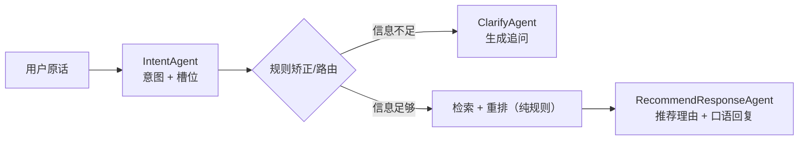
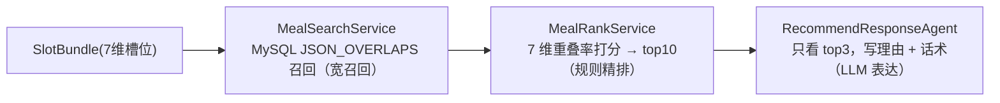

# AI Agent 工程师视角：这个项目是怎么从 0 到 1 到 100 写出来的

> 读者对象：有 Java 后端基础、但对 Agent 工程还不熟的同学。
> 这份文档模拟“作者当初是怎么一步步把这个项目搭出来的”，每一节都会先给**当时遇到的问题**，再给**为什么这样设计**。

先记住一个类比，后面全部能对上：

| Agent 工程概念 | 你熟悉的 Java 后端类比 |
|---|---|
| Agent（如 IntentAgent） | 一个“用 LLM 实现的特殊函数”，输入文本 → 输出结构化 JSON |
| 编排层 Orchestrator | Controller + Service + 状态机，决定“下一步调谁、按什么顺序” |
| 槽位 Slot | 请求 DTO 里的字段（餐次/口味/心情…），只是由 LLM 从自然语言里抽取 |
| 意图 Intent | 路由的依据（类似 URL → Controller 的路由表） |
| Trace | 日志 + 调用链监控，记录每一轮每个节点的输入/输出/耗时 |
| 离线评估 | 回归测试 + 监控大盘，只是测的是 LLM 输出质量 |
| Fallback | try-catch + 降级策略，LLM 挂了业务不能挂 |

---

## 阶段 0→1：先跑通“对话 → 推荐”这个最小闭环

### 1.1 第一步：只验证“值不值得做”

作者的第一版**没有**多 Agent、没有 Trace、没有评估。只有一个想法：

> 用户说“晚饭想吃清淡点”，系统能给出合理的推荐。

最小实现只需要三样东西：

1. **一个 LLM 调用**：把用户的话 + 预设 prompt 发给模型；
2. **一个餐食库**：否则 LLM 会推荐“用户店里没有的菜”；
3. **一个会话 ID**：否则多轮追问“中午还是晚上？”没有地方存答案。

于是第一版诞生：

- 建一张表 `meal_item`（餐食 + 7 类标签），先手工插入几条公共菜；
- 写一个 `POST /chat` 接口：调 LLM 让用户把需求说清楚 → 把整张表丢给 LLM → LLM 返回推荐；
- 写一个最小前端页面，能发消息、能看回复。

### 1.2 第一版马上暴露的三个问题

跑几天就会遇到（这也是所有 LLM 应用的第一课）：

1. **不可控**：同一句话，模型有时推荐“番茄鸡蛋面”，有时推荐“佛跳墙”（库里根本没有）；理由时好时坏。
2. **无状态**：用户说“晚上吃”“嗯再清淡点”，系统记不住上一轮，无法理解“再”字。
3. **不可测**：效果全靠肉眼判断，没法说“这周意图识别准确率多少”。

这三个问题，正好对应后面三个大阶段：
**不可控 → 拆多 Agent + 规则兜底（阶段 1→10）**
**无状态 → 会话状态机（阶段 1→10）**
**不可测 → Trace + 离线评估（阶段 10→100）**

### 1.3 这一阶段的交付物（对应现在的代码）

- `meal_item` 表 + `MealController`/`MealService`/`MealMapper`：餐食 CRUD；
- `diet_sessions`/`diet_messages` 表 + `SessionService`：会话与消息落库；
- 一个最朴素的 `/chat`（现在演变成了 `DietChatController` + `DietOrchestratorService`）。

> 设计原则 1：**先让用户能完整走一遍流程，再谈工程化。** 很多 Agent 项目死在第一步就追求“完美架构”。

---

## 阶段 1→10：工程化 —— 从“单 Agent”到“多 Agent + 编排中枢”

这一阶段解决“不可控”。作者做的第一件事不是调 prompt，而是**重新划分职责**。

### 2.1 为什么拆成多个 Agent？

最初是一个 prompt 同时干三件事：判断意图、抽取槽位、生成推荐回复。问题：

- **输出互相干扰**：生成推荐回复时，模型容易“顺手”改掉前面的槽位；
- **没法单独优化**：意图识别老出错，但 prompt 里全是推荐话术，改哪都会影响别的；
- **没法单独评估**：想测“意图准确率”，得从一大段输出里再解析一遍。

解法是**单一职责**：把一条链路拆成四个“专职 Agent”，每个 Agent 只做一件事、只输出一种 JSON：



这 4 个 Agent 就是现在的 `IntentAgent / ClarifyAgent / RecommendResponseAgent / PlanResponseAgent`（外加离线用的 `EvaluationJudgeAgent`）。

> 设计原则 2：**Agent 的粒度 = 可独立测试/独立评估的最小业务单元。** 和“拆 Service、拆 Mapper”是同一个道理，只是拆分依据从“数据边界”变成了“LLM 推理职责”。

### 2.2 意图识别为什么要“词典强约束 + 三层兜底”

拆出 IntentAgent 后，作者发现第二个问题：**LLM 会编造标签**。

用户说“想吃点辣的”，模型可能输出 `taste: ["微辣", "重辣", "香辣"]`，但库里根本没有“香辣”这个标签。解决办法分两层：

1. **词典约束（防幻觉）**：`diet_slot_option` 表维护 7 个维度各自的合法标签。prompt 里写明“slots 只能从 slotOptions 里选，没有就输出 null”；代码里 `SlotJsonPicker` 再把 LLM 输出和词典比对，非法的一律丢弃。**LLM 是“候选人”，词典是“裁判”**。

2. **三层兜底（防误判）**：就算 IntentAgent 识别错了，规则层也能救：
   - `IntentReviseService`：历史状态矫正（如“换一批”但本会话从没推荐过 → 降级为普通推荐）、关键词强制（“三餐/规划今日” → 强制 `MEAL_PLAN`）、低置信度（< 0.4）降级为澄清；
   - 关键词 Fallback：LLM 超时/JSON 解析失败时，直接按关键词扫描给一个保守意图，保证链路不中断。

> 设计原则 3：**LLM 只负责“理解”，不负责“做决定”。** 所有影响业务正确性的决策点，都要有规则层把关。这也是本项目和“纯 prompt 工程”产品的本质区别。

### 2.3 澄清为什么要“规则决定要不要问，LLM 只负责怎么问”

用户说“帮我推荐一个”，信息太少直接推荐一定是瞎猜。于是要澄清。但作者刻意做了这样的分工：

- **要不要问** → `ClarifyRuleService.missingSlots()`，纯 Java 规则：`mealTime` 必填；没有明确口味/菜系偏好时 `healthGoal` 必填。
- **怎么问** → 才轮到 `ClarifyAgent` 生成一句自然的追问。

为什么？因为“要不要问”是**状态机的关键分支**，如果交给 LLM，同一句话可能这次问、下次不问，状态流转就不确定、没法测试；而“问得是否自然”是**体验问题**，交给 LLM 很合适。LLM 失败时还有 `fallbackQuestion` 模板兜底。

> 设计原则 4：**决策要确定性，表达要灵活性。** 凡是影响流程走向的判断，用规则；凡是影响用户体验的话术，用 LLM。

### 2.4 检索重排为什么要放在 LLM 之前（本项目最重要的设计）

这是作者踩坑最深的一步。早期版本是“把餐食表整个丢给 LLM，让它挑”。问题：

- 库里菜多了以后，prompt 塞不下、还贵；
- LLM 会“挑花眼”，甚至挑库里没有的菜（幻觉）；
- 推荐理由和候选互相矛盾：“推荐番茄鸡蛋面，理由是低脂”——但番茄鸡蛋面标签根本没有低脂。

最终架构改成**两段式**，这也是业界经典的“RAG 式”思路：



- **检索（Java + SQL）**：`JSON_OVERLAPS` 只要任意一维标签相交就进候选，保证“宽召回”；
- **重排（Java）**：`matchScore = 7 维命中比例均值`，越贴合用户输入越靠前，并排除已推荐过的菜；
- **生成（LLM）**：只拿到 top3 候选，prompt 强制“`mealId` 必须来自候选，不能编造”。**选菜的权利从 LLM 手里收回，LLM 只负责“解释为什么选它”。**

> 设计原则 5：**不要让 LLM 做它不擅长的精确检索，只让它做它擅长的语言表达。** 数据筛选用确定性系统，LLM 当“翻译官”而不是“数据库”。

### 2.5 会话状态为什么要“编排层唯一写”

多轮对话需要记住：已经聊到哪（phase）、已经收集了哪些槽位（slots）、上一轮推荐了哪些菜（lastRecommendations，供“换一批”排除）。

作者明确了一个规矩：**只有 `DietOrchestratorService` 能写 `SessionState`**，Agent 一律不能碰。为什么？

- 如果每个 Agent 都能改状态，状态会乱、没法回放；
- 状态是“流程的真相”，必须由唯一入口串行维护；
- 有了唯一写者，`SessionStateService` 的 load/save、会话级 `synchronized(lock)` 才有意义。

多轮槽位合并 `SlotMergeService` 也很讲究：**本轮非空覆盖历史，本轮为空保留历史**。用户说“晚上吃面”——“晚上”是新的 `mealTime`，但之前说的“清淡”不能被冲掉。

> 设计原则 6：**状态机要收敛到一个中枢。** Agent 是无状态的“函数”，编排层是唯一有状态的地方。这也让整个系统可测试——给相同的会话状态，必然走相同的分支。

### 2.6 Agent 为什么要按 session 缓存、每次调用前清 memory

AgentScope 的 `ReActAgent` 自带 memory。作者发现两件事：

1. **不同用户不能共享 Agent**：A 用户聊的内容会串到 B 用户 → `AgentFactory` 按 `sessionId` 缓存一组 Agent（LRU 上限 1000，防止内存泄漏）；
2. **同一 session 里上一轮的 memory 会污染本轮**：本轮意图识别时，模型会“记得”上一轮推荐了啥，导致判断偏差 → 每个 Agent 调用前 `agent.getMemory().clear()`。

那多轮上下文怎么办？不走 Agent memory，而是由 `SessionService.recentConversationTurns()` 从库里取最近 3 轮，**摘要压缩后显式拼进 prompt**。这样上下文是“受控的、可审计的”，而不是黑盒 memory。

> 设计原则 7：**显式上下文优于隐式记忆。** 需要什么上下文，就从数据库取、拼进 prompt；不要让 Agent 内部 memory 悄悄膨胀。

### 2.7 全链路 Fallback：为什么每个 LLM 调用都要有规则兜底

作者的工程习惯是“任何外部依赖都必须有降级”。LLM 是系统里最不稳定的依赖（超时、限流、输出烂 JSON），所以每一处 LLM 调用都配了兜底：

| 调用点 | 兜底 |
|---|---|
| IntentAgent | 关键词扫描 fallback |
| ClarifyAgent | `ClarifyRuleService.fallbackQuestion()` 模板 |
| RecommendResponseAgent | 模板理由 + 模板话术 |
| PlanResponseAgent | 模板方案 + 模板话术 |
| EvaluationJudgeAgent | 返回 null，跳过该维度 |

效果：**用户永远不会收到“服务器开小差”**——最差也能收到模板化的推荐，且兜底会被记进 Trace（如 `NUTRITION_GUARD_REWRITTEN`），线上能看出来“这轮走了降级”。

> 设计原则 8：**把 LLM 当“远程 RPC 服务”对待：设超时、做校验、给降级。** 这也是后端思维在 Agent 工程里的直接迁移。

### 2.8 健康风险守卫（安全底线）

作者额外加了一层 `RiskGuardService`：在最终回复发出前，用规则扫描“医疗承诺、极端节食、绝育话术”等关键词，命中就用保守文案替换。这层**永远用规则、不用 LLM**——因为安全合规需要确定性。

---

## 阶段 10→100：可观测 + 评估闭环 —— 从“能用”到“敢上线、能迭代”

### 3.1 为什么必须做 Trace

系统上线后，作者遇到最头疼的问题：**LLM 是黑盒，出问题没法复现**。

- 用户说“我昨天问的怎么推荐得这么差？”——你根本不知道当时 LLM 收到了什么、输出了什么；
- 加了新 prompt 后意图识别变差，但不知道是哪一个环节退化；
- 一次调用链路里有 4 个 Agent，报错时不知道卡在哪一环。

这就像后端没有日志、没有调用链。所以作者做了一个“**LLM 应用的调用链**”：每一轮请求生成一个 `traceId`，在关键节点记录事件，整条链路落库可回放。

### 3.2 Trace 怎么设计（作者的心路）

1. **事件模型**：一个 Trace = 一串有序事件。每个事件带 `eventType`（如 `INTENT_RECOGNIZED`）、`phase`（INTENT/SEARCH/RANK…）、输入 payload、输出 payload、耗时、Token。事件即插即用，加新环节只需加一个新事件，不用改表结构（全部塞进 `trace_json`）。
2. **埋点方式**：`AgentTraceService` 用 **ThreadLocal** 保存当前请求的 `TraceScope`，业务代码里 `recordEvent(...)` 即可。`try-with-resources` 结束时统一 flush 落库。
3. **统一 Agent 调用入口**：所有 Agent 调用都走 `agentTraceService.callAgent(...)`，这样“模型名、耗时、Token 数”自动进 Trace，业务代码不需要重复埋点。
4. **落库失败不影响业务**：`close()` 里 catch 掉，只打 warn。**可观测不能成为业务可用性的反向依赖**。

> 设计原则 9：**可观测数据要为“回放”设计。** 每个事件都存输入和输出，线上问题才能“逐步回放”，而不是只有一行错误日志。

### 3.3 为什么需要离线评估

Trace 只是“看得见”，还不能“说得清好不好”。人工逐条看对话不现实，所以需要**批量打分**。作者的评估思路很朴素：**把 Trace 当测试集，把规则当断言，把 LLM Judge 当人工抽检的代理，把用户反馈当真实答案。**

### 3.4 评估怎么设计：三源加权

`EvaluationService` 对每条 Trace 输出一个百分制分数，来源有三个：

```
总分 = (规则分 × 0.6 + LLM Judge 分 × 0.1 + 用户反馈分 × 0.3) / 实际存在项的权重和
```

| 来源 | 权重 | 含义 | 为什么是这个权重 |
|---|---|---|---|
| 规则分 | 60% | 意图/槽位/澄清准确率、Token、延迟、fallback、安全、幻觉 | 客观、可复现，是主干 |
| LLM Judge | 10% | 回复的解释质量和自然度（1–5 分） | 主观体验，LLM 打分本身不可靠，只给低权重 |
| 用户反馈 | 30% | 点赞/点踩/换一批（rating/action 归一化） | 真实用户信号，但稀疏，所以居中 |

两个细节体现了作者的工程经验：

1. **缺失归一化**：没有人工标注的 Trace，`intentAccuracy` 返回 null，**不参与平均，也不当 0 分误伤**；
2. **黄金样本驱动**：人工标注（`expected_intent / expected_slots / expected_clarify_action`）只影响准确率类指标；低分样本 → 标注 → 改 prompt/规则 → 再评估，形成“**Trace 标注 → 批量评估 → 指标驱动迭代**”的闭环。

> 设计原则 10：**评估体系要能指出“哪里不好、为什么”，而不是只给一个总分。** 指标明细 + 单条诊断（`detail` 字段）是迭代的抓手。

### 3.5 用户反馈怎么进评估

前端每个推荐卡片带“喜欢/不喜欢/换一批”。这些 action 存 `recommend_feedback`，评估时按 session 归属到对应 Trace，映射成分数：LIKE=1、DISLIKE=0、SWITCH=0.4。这样**用户行为数据直接进评估分数**，而不是永远躺在库里没人看。

### 3.6 产品化：研发侧界面

最后作者补了研发侧的两个页面（对应前端 `#/admin/traces` 和 `#/admin/evaluations`）：

- **Trace 页**：按时间/会话查 Trace、展开事件时间线、填写期望意图/槽位/澄清动作（标注）；
- **评估页**：选时间窗 → 跑批量评估 → 看总分、各指标均值、单条明细与诊断。

至此项目形成完整闭环：**使用（聊天）→ 反馈（点赞/换一批）→ 标注（Trace 页）→ 评估（评估页）→ 迭代（改 prompt/规则）**。

---

## 作者视角的“为什么”速查表

| # | 设计决策 | 动机 | 代价/边界 |
|---|---|---|---|
| 1 | 先做 MVP 再做架构 | 快速验证价值 | 早期代码要重构 |
| 2 | 拆 4 个专职 Agent | 单一职责、可单独优化和评估 | 调用次数变多、链路变长 |
| 3 | 词典强约束槽位 | 防 LLM 编造标签 | 词典要维护，新词要入库 |
| 4 | 规则决定“要不要问” | 状态机需要确定性 | 规则覆盖不了所有场景 |
| 5 | 检索重排在 LLM 前 | 防幻觉、省 token、可控 | 召回质量依赖标签体系 |
| 6 | 编排层唯一写状态 | 状态可测试、可回放 | 编排层变得很大（上帝类风险） |
| 7 | 显式上下文替代 memory | 上下文受控可审计 | 每轮要查库、要压缩 |
| 8 | 每处 LLM 都有 fallback | LLM 不稳定，业务不能断 | 兜底输出质量低于 LLM |
| 9 | Trace 事件化 + 落库 | 黑盒问题可回放 | 写库开销、Trace 数据膨胀 |
| 10 | 三源加权评估 | 客观 + 主观 + 真实三方互证 | Judge 本身可能不准 |

---

## 从 100 到更多：作者接下来会做的事（扩展路线）

如果继续演进，合理的方向（也方便面试时讲“我能怎么改进”）：

1. **异步化 Trace**：现在同步落库，量大后可改 MQ 异步 + 独立 Trace 存储（ES/ClickHouse）；
2. **会话与锁外置**：`ConcurrentHashMap` 锁和 LRU Agent 缓存都是单机的，水平扩展时迁到 Redis；
3. **流式输出**：`/chat` 目前是同步返回，可改 SSE 流式，首字延迟更优；
4. **检索升级**：标签检索 → 向量检索（菜谱语义相似度）做混合召回；
5. **评估增强**：LLM Judge 增加“多 Agent 互相评判”，加在线 A/B 实验，加 Bad-case 自动聚类；
6. **数据治理**：`recommend_feedback` 关联 `traceId`，让反馈精确落到单条 Trace；
7. **工程治理**：修复 `DietExceptionHandler` 包名问题、把明文密钥迁到环境变量、统一源码 UTF-8。

---

## 一句话总结这个项目的方法论

> **“把 LLM 当成一个不可靠但很会说话的外包员工来管理：给它明确的职责（Agent）、明确的输入格式（JSON + 词典）、明确的汇报机制（Trace），再派一个 Java 老员工（Orchestrator）盯流程、兜底、做质检（评估）。”**

下一份文档：`FILE_REFERENCE.md` —— 每个文件是干什么的、每个功能涉及哪些文件。
