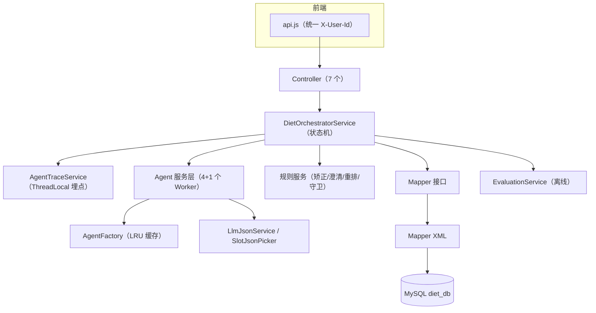

# 文件清单与功能映射

> 这是 `diet-agent` 项目**所有文件**的用途说明，以及**每个功能涉及哪些文件**的索引。
> 阅读方式：先看第 1 节了解每个文件，再看第 2 节按功能反查。

源码根目录：`src/main/java/com/diet`；资源根目录：`src/main/resources`。

---

## 1. 全文件清单（按模块）

### 1.1 启动与配置

| 文件 | 用途 |
|---|---|
| `DietApplication.java` | Spring Boot 启动类。`@MapperScan("com.diet.mapper")` 扫描 MyBatis Mapper |
| `src/main/resources/application.yml` | 全局配置：数据源、MyBatis、端口、AgentScope API Key、主/轻量模型名、会话历史轮数 |
| `pom.xml` | Maven 依赖：Spring Boot Web、MyBatis、MySQL 驱动、AgentScope Starter、Lombok、Hutool |
| `lombok.config` | Lombok 全局配置 |

### 1.2 配置 / 常量 / 异常

| 文件 | 用途 |
|---|---|
| `config/DietAgentScopeConfig.java` | 注册两个 DashScope `Model` Bean：`DietMainChatModel`（qwen-max）和 `DietLightChatModel`（qwen-turbo） |
| `constants/DietConstants.java` | 常量：请求头名 `X-User-Id` |
| `exception/DietException.java` | 业务异常基类（RuntimeException） |
| `exception/DietExceptionHandler.java` | 全局异常处理：`DietException` → 400，其他 → 500（注意：`basePackages="com.diet.newdiet"` 与真实包名不符，实际不生效） |

### 1.3 Controller 层（HTTP 入口）

| 文件 | 路由 | 用途 |
|---|---|---|
| `controller/chat/DietChatController.java` | `POST /api/v1/diet/chat` | 对话主入口，透传给 Orchestrator |
| `controller/session/SessionController.java` | `POST /api/v1/diet/sessions` | 创建会话 |
| `controller/meal/MealController.java` | `/api/v1/diet/meals/personal|public` | 个人/公共餐食 CRUD |
| `controller/slot/SlotOptionController.java` | `GET /api/v1/diet/slot-options` | 返回槽位字典 |
| `controller/feedback/FeedbackController.java` | `POST /api/v1/diet/feedback` | 保存用户反馈 |
| `controller/trace/AgentTraceController.java` | `/api/v1/diet/debug/traces...` | Trace 查询、会话轨迹、时间窗列表、人工标注 |
| `controller/evaluation/EvaluationController.java` | `POST /api/v1/diet/evaluations` | 触发离线批量评估 |

### 1.4 编排层（核心）

| 文件 | 用途 |
|---|---|
| `service/orchestrator/DietOrchestratorService.java` | **全项目核心**。会话状态机唯一入口：加载会话 → 开 Trace → 会话锁 → 落用户消息 → 意图识别 → 规则矫正 → 槽位合并 → 路由分发（推荐/调整/规划/澄清/健康风险/闲聊）→ 检索重排 → Agent 生成 → 守卫 → 落库 → 返回 |

### 1.5 Agent 层

| 文件 | 用途 |
|---|---|
| `agent/builder/IntentAgentBuilder.java` | 构建 IntentAgent：`qwen-turbo` + `intent.txt` prompt |
| `agent/builder/ClarifyAgentBuilder.java` | 构建 ClarifyAgent：`qwen-turbo` + `clarify.txt` prompt |
| `agent/builder/RecommendResponseAgentBuilder.java` | 构建 RecommendResponseAgent：`qwen-max` + `recommend-response.txt` prompt |
| `agent/builder/PlanResponseAgentBuilder.java` | 构建 PlanResponseAgent：`qwen-max` + `plan-response.txt` prompt |
| `agent/builder/EvaluationJudgeAgentBuilder.java` | 构建 EvaluationJudgeAgent：`qwen-turbo` + `evaluation-judge.txt` prompt |
| `agent/factory/AgentFactory.java` | 按 `sessionId::promptVersion` 缓存一组 Agent（LRU 1000），避免跨用户串线 |
| `agent/loader/PromptLoader.java` | 从 classpath 读取 prompt 文本文件 |

### 1.6 Service 层

| 文件 | 用途 |
|---|---|
| `service/intent/IntentAgentService.java` | 调 IntentAgent：组装带槽位词典的 prompt、解析 JSON、失败时关键词 Fallback |
| `service/intent/IntentReviseService.java` | 意图规则矫正：健康风险优先、无历史“调整”降级、多餐关键词强制、低置信度降级澄清 |
| `service/clarify/ClarifyRuleService.java` | **规则决定是否追问**：计算缺失槽位（mealTime 必填等）、模板追问兜底 |
| `service/clarify/ClarifyAgentService.java` | 缺槽时才调 ClarifyAgent 生成自然追问，LLM 失败走模板 |
| `service/slot/SlotOptionService.java` | 加载槽位词典、校验标签合法性 |
| `service/slot/SlotMergeService.java` | 多轮槽位合并：本轮非空覆盖历史，空则保留历史 |
| `service/meal/MealSearchService.java` | 检索入口：校验参数后调 `MealService.search` |
| `service/meal/MealRankService.java` | 重排：7 维槽位重叠率打分、排除已推荐、取 top10 |
| `service/meal/MealService.java` | 餐食 CRUD + `JSON_OVERLAPS` 标签检索（limit 50）、个人空库检查 |
| `service/plan/MealPlanService.java` | 多餐规划：解析餐次（三餐/早中晚）、逐餐次检索重排各取 top1、跨餐排重 |
| `service/plan/PlanResponseAgentService.java` | 调 PlanResponseAgent 生成多餐方案话术，失败走模板 |
| `service/recommend/RecommendResponseAgentService.java` | 调 RecommendResponseAgent 生成 top3 推荐理由 + 口语回复，失败走模板 |
| `service/risk/RiskGuardService.java` | 健康风险守卫：关键词扫描用户输入+最终回复，命中则替换保守文案 |
| `service/session/SessionStateService.java` | 会话状态的 load/create/save（`diet_sessions` 表，slots/lastRecommendations 以 JSON 存取） |
| `service/session/SessionService.java` | 会话消息落库（`diet_messages`）、最近 3 轮对话摘要（供 IntentAgent） |
| `service/trace/AgentTraceService.java` | **Trace 引擎**：ThreadLocal TraceScope、recordEvent/recordError、统一 callAgent（自动记录模型名/耗时/Token）、close 时落库 |
| `service/evaluation/EvaluationService.java` | 离线评估：解析 Trace → 规则指标 + LLM Judge + 用户反馈 → 三源加权百分制报告 |
| `service/evaluation/EvaluationJudgeService.java` | 调 EvaluationJudgeAgent 打分（explanationQuality/naturalness），失败返回 null |
| `service/feedback/FeedbackService.java` | 校验并保存用户反馈 |

### 1.7 Mapper 层

| 文件 | 对应 XML | 用途 |
|---|---|---|
| `mapper/AgentTraceMapper.java` | `mapper/AgentTraceMapper.xml` | `diet_request_trace` 的插入、按 traceId/sessionId/时间窗查询、标注更新 |
| `mapper/SessionMapper.java` | `mapper/SessionMapper.xml` | `diet_sessions` 与 `diet_messages` 的读写、最近消息查询 |
| `mapper/MealMapper.java` | `mapper/MealMapper.xml` | `meal_item` CRUD 与 `JSON_OVERLAPS` 标签检索 |
| `mapper/SlotOptionMapper.java` | `mapper/SlotOptionMapper.xml` | 槽位词典查询 |
| `mapper/FeedbackMapper.java` | `mapper/FeedbackMapper.xml` | 用户反馈插入、按 session 批量查询 |

### 1.8 枚举

| 文件 | 用途 |
|---|---|
| `enums/Intent.java` | 6 类意图：MEAL_RECOMMENDATION / CLARIFY_NEEDED / MEAL_ADJUST / MEAL_PLAN / HEALTH_RISK / OTHER |
| `enums/SessionPhase.java` | 会话阶段：START / CLARIFY / RECOMMEND / PLAN |
| `enums/ClarifyAction.java` | 澄清结果：ASK（追问）/ READY（信息足够） |
| `enums/SourceMode.java` | 数据源模式：PERSONAL（个人库）/ PUBLIC（公共库） |
| `enums/RiskLevel.java` | 风险等级：LOW / HIGH |

### 1.9 模型（DTO / 行模型）

| 文件 | 用途 |
|---|---|
| `model/SlotBundle.java` | 7 维槽位（mealTime/mood/scene/healthGoal/cuisine/taste/convenience），统一空值归一 |
| `model/SessionState.java` | 会话状态对象（sessionId/userId/phase/sourceMode/currentIntent/slots/lastRecommendations） |
| `model/IntentResult.java` | IntentAgent 结构化输出：intent + slots + confidence |
| `model/ClarifyResult.java` | 澄清结果：action(ASK/READY) + questionToAsk + missingSlots |
| `model/RecommendResult.java` | 推荐结果：recommendations + needDisclaimer |
| `model/RecommendedMealOption.java` | 单个推荐项：mealId + name + reason + matchScore + matchedSlots |
| `model/ResponseResult.java` | 编排层最终回答：speechText + displayBlocks + nextAction |
| `model/RiskGuardResult.java` | 守卫结果：passed + riskLevel + blockedReasons + rewriteSuggestion |
| `model/ChatRequest.java` | 聊天请求：sessionId + message + sourceMode + context |
| `model/ChatResponse.java` | 聊天响应：speechText + displayBlocks + clarifyQuestion + missingSlots 等 |
| `model/MealRequest.java` | 餐食新增/更新请求 |
| `model/MealResponse.java` | 餐食响应（含 matchScore），`from(MealItem)` 转换 |
| `model/MealItem.java` | 餐食领域对象（id/sourceType/ownerUserId/name/slots/matchScore） |
| `model/MealItemRow.java` | 餐食数据库行（JSON 字段以字符串存储） |
| `model/MealSearchRequest.java` | 检索请求：sourceMode + userId + slots + excludeMealIds |
| `model/MealRankRequest.java` | 重排请求：candidates + slots + excludeMealIds |
| `model/ConversationTurn.java` | 对话历史中的一轮摘要（role/intent/summary/timestamp） |
| `model/CreateSessionResponse.java` | 创建会话响应（sessionId） |
| `model/FeedbackRequest.java` | 用户反馈请求（sessionId/itemId/action/rating/reason） |
| `model/FeedbackRow.java` | 用户反馈数据库行 |
| `model/SessionRow.java` | 会话数据库行 |
| `model/SessionMessageRow.java` | 消息数据库行 |
| `model/RequestTraceRow.java` | Trace 数据库行（含标注字段） |
| `model/TraceLabelRequest.java` | 人工标注请求（expectedIntent/expectedSlots/expectedClarifyAction/labelNote） |
| `model/EvaluationRequest.java` | 评估请求（startAt/endAt/includeLlmJudge/limit） |
| `model/EvaluationReport.java` | 评估报告（区间、平均分、指标均值、单条明细） |
| `model/TraceEvaluationResult.java` | 单条 Trace 的评估结果（总分/规则分/Judge分/反馈分/指标/诊断） |
| `model/EvaluationJudgeResult.java` | LLM Judge 输出（explanationQuality/naturalness/reason） |

### 1.10 工具类

| 文件 | 用途 |
|---|---|
| `util/LlmJsonService.java` | 从 LLM 回复文本中提取 JSON（兼容 ```json 围栏），解析失败抛异常 |
| `util/SlotJsonPicker.java` | 从 LLM 输出的 slots JSON 中**只保留词典内合法标签**（防幻觉核心工具） |
| `util/JsonService.java` | `List<String>` 与 JSON 数组字符串互转 |

### 1.11 资源文件

| 文件 | 用途 |
|---|---|
| `resources/db/diet_db.sql` | 建库建表（6 张表）+ 槽位词典 + 示例公共餐食 |
| `resources/application.yml` | 见 1.1 |
| `resources/mapper/*.xml` | MyBatis SQL（5 个，与 Mapper 接口一一对应） |
| `resources/diet/prompts/intent.txt` | IntentAgent 系统提示词：6 类意图定义、槽位抽取规则、JSON 输出格式 |
| `resources/diet/prompts/clarify.txt` | ClarifyAgent 提示词：根据缺失字段生成一句自然追问 |
| `resources/diet/prompts/recommend-response.txt` | RecommendResponseAgent 提示词：top3 理由 + 口语回复，禁止编造 mealId |
| `resources/diet/prompts/plan-response.txt` | PlanResponseAgent 提示词：多餐方案话术 |
| `resources/diet/prompts/evaluation-judge.txt` | EvaluationJudgeAgent 提示词：只打 explanationQuality / naturalness 两维 |
| `resources/static/index.html` | 前端单页入口（hash 路由 + 6 个导航页面） |
| `resources/static/assets/js/api.js` | 前端 API 封装（统一带 `X-User-Id` 头） |
| `resources/static/assets/js/app.js` | 前端业务逻辑：聊天/餐食库/Trace/评估四个模块 |
| `resources/static/assets/css/app.css` | 前端样式 |

---

## 2. 每个功能涉及哪些文件

### 功能 1：对话推荐（核心主流程）

```
DietChatController → DietOrchestratorService → SessionStateService(load)
  → SessionService(appendMessage) → IntentAgentService → SlotOptionService(词典)
  → IntentReviseService → SlotMergeService → ClarifyRuleService/ClarifyAgentService
  → MealSearchService → MealService/MealMapper(xml) → MealRankService
  → RecommendResponseAgentService → RiskGuardService → SessionStateService(save)
  → SessionService(appendMessage) → AgentTraceService(全程埋点)
```

涉及文件：`controller/chat/DietChatController.java`、`service/orchestrator/DietOrchestratorService.java`、`service/intent/*`、`service/clarify/*`、`service/slot/*`、`service/meal/*`、`service/recommend/*`、`service/risk/RiskGuardService.java`、`service/session/*`、`service/trace/AgentTraceService.java`、`agent/*`、`mapper/*`、`model/*`、`resources/diet/prompts/*.txt`、`resources/mapper/*.xml`。

### 功能 2：多餐规划（“规划今天三餐”）

```
意图识别 → IntentReviseService(多餐关键词强制 MEAL_PLAN) → MealPlanService.resolveMealTimes
  → MealPlanService.planMeals(逐餐次检索重排, 跨餐排重) → PlanResponseAgentService
  → RiskGuardService → 落库
```

涉及文件：`service/intent/IntentReviseService.java`、`service/plan/MealPlanService.java`、`service/plan/PlanResponseAgentService.java`、`agent/builder/PlanResponseAgentBuilder.java`、`resources/diet/prompts/plan-response.txt`，其余与主流程共用。

### 功能 3：换一批 / 调整推荐（MEAL_ADJUST）

```
IntentAgent 识别出调整意图 → IntentReviseService(无历史则降级)
  → SlotMergeService(合并新槽位) → 取出 lastRecommendations 作为 excludeMealIds
  → 重跑检索+重排（排除已推荐）→ RecommendResponseAgent
```

涉及文件：`service/intent/IntentReviseService.java`、`service/slot/SlotMergeService.java`、`service/meal/MealRankService.java`（排除逻辑）、`model/SessionState.java`（`lastRecommendations`）。

### 功能 4：个人餐食库 CRUD

```
MealController → MealService(create/update/delete/findPersonal)
  → SlotOptionService.validate(词典校验) → JsonService(JSON 序列化)
  → MealMapper/MealMapper.xml
```

涉及文件：`controller/meal/MealController.java`、`service/meal/MealService.java`、`service/slot/SlotOptionService.java`、`util/JsonService.java`、`mapper/MealMapper.java` + `mapper/MealMapper.xml`、`model/MealRequest/MealResponse/MealItem/MealItemRow.java`。

### 功能 5：公共餐食库

```
MealController → MealService.findPublicMeals → MealMapper.findPublicMeals
```

涉及文件：同上，但只走 `findPublicMeals`（`source_type='PUBLIC'`）。

### 功能 6：槽位字典

```
SlotOptionController → SlotOptionService.findAllOptions → SlotOptionMapper.findEnabledValues
```

涉及文件：`controller/slot/SlotOptionController.java`、`service/slot/SlotOptionService.java`、`mapper/SlotOptionMapper.java` + `mapper/SlotOptionMapper.xml`、`resources/db/diet_db.sql`（数据源）。

### 功能 7：健康风险守卫

```
RiskGuardService.check(用户输入 + 最终回复) → 命中则 ResponseResult.textOnly(保守文案)
  → Trace 记录 NUTRITION_GUARD_REWRITTEN
```

涉及文件：`service/risk/RiskGuardService.java`、`model/RiskGuardResult.java`、`enums/RiskLevel.java`、`model/ResponseResult.java`（编排层调用处）。

### 功能 8：Trace 排查与标注

```
埋点：AgentTraceService.recordEvent / callAgent（编排层与各 Agent Service 调用）
落库：AgentTraceMapper.insert → diet_request_trace.trace_json
查询：AgentTraceController(/debug/traces...) → AgentTraceService.findBy* → AgentTraceMapper.xml
标注：PUT /debug/traces/{traceId}/label → updateLabel
```

涉及文件：`service/trace/AgentTraceService.java`、`controller/trace/AgentTraceController.java`、`mapper/AgentTraceMapper.java` + `mapper/AgentTraceMapper.xml`、`model/RequestTraceRow.java`、`model/TraceLabelRequest.java`。

### 功能 9：离线批量评估

```
EvaluationController → EvaluationService.evaluate
  → AgentTraceService.findByTimeRange(拉 Trace)
  → FeedbackMapper.findBySessions(拉反馈)
  → 逐条 parseTrace → 规则指标 + EvaluationJudgeService(LLM Judge) + feedbackScore
  → weightedScore(60/10/30) → EvaluationReport
```

涉及文件：`controller/evaluation/EvaluationController.java`、`service/evaluation/EvaluationService.java`、`service/evaluation/EvaluationJudgeService.java`、`agent/builder/EvaluationJudgeAgentBuilder.java`、`resources/diet/prompts/evaluation-judge.txt`、`model/EvaluationRequest/EvaluationReport/TraceEvaluationResult/EvaluationJudgeResult.java`、`mapper/FeedbackMapper.java` + `mapper/FeedbackMapper.xml`。

### 功能 10：用户反馈

```
前端卡片按钮 → FeedbackController → FeedbackService.save → FeedbackMapper.insert
评估时：FeedbackMapper.findBySessions → feedbackScore
```

涉及文件：`controller/feedback/FeedbackController.java`、`service/feedback/FeedbackService.java`、`mapper/FeedbackMapper.java` + `mapper/FeedbackMapper.xml`、`model/FeedbackRequest/FeedbackRow.java`、`service/evaluation/EvaluationService.java`（消费端）。

### 功能 11：前端页面

| 页面 | 路由 | 主要函数（app.js） |
|---|---|---|
| 首页 | `#/diet` | `renderHome`、`loadHomeStats` |
| 聊天推荐 | `#/diet/chat` | `renderChat`、`renderMessage`（调用 `DietApi.createSession/chat/saveFeedback`） |
| 个人餐食库 | `#/diet/meals/personal` | `renderPersonalMeals`、`renderMealForm`、`renderSlotPicker` |
| 公共餐食库 | `#/diet/meals/public` | `renderPublicMeals` |
| Trace | `#/admin/traces` | `renderTraces`、`renderTraceTable`、`renderTraceDetail`（调用 `DietApi.listTraces/getTrace/labelTrace`） |
| 评估 | `#/admin/evaluations` | `renderEvaluations`、`renderEvaluationReport`、`renderMetrics`（调用 `DietApi.evaluate`） |

涉及文件：`resources/static/index.html`、`resources/static/assets/js/api.js`、`resources/static/assets/js/app.js`、`resources/static/assets/css/app.css`。

---

## 3. 请求进来后的调用链总览



下一份文档：`INTERVIEW_QUESTIONS.md` —— 面试问题与答题思路。
